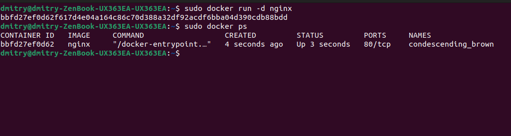

# SimpleDocker

##

## Part 1. Готовый докер

### Взять официальный докер образ с **nginx** и выкачать его при помощи `docker pull`

<figure><figcaption></figcaption></figure>

### Проверить наличие докер образа через `docker images`

<figure><figcaption></figcaption></figure>

### **Запустить докер образ через `docker run -d [image_id|repository]`Проверить, что образ запустился через `docker ps`**

<figure><figcaption>
\
</figcaption></figure>

### Посмотреть информацию о контейнере через `docker inspect [container_id|container_name]` **По выводу команды определить и поместить в отчёт размер контейнера, список замапленных портов и ip контейнера**

<figure><figcaption></figcaption></figure>

### **Остановить докер образ через `docker stop [container_id|container_name]` Проверить, что образ остановился через `docker ps`**

<figure><figcaption></figcaption></figure>

### **Запустить докер с портами 80 и 443 в контейнере, замапленными на такие же порты на локальной машине, через команду **_**run**_

<figure><figcaption></figcaption></figure>

### Проверить, что в браузере по адресу _localhost:80_ доступна стартовая страница **nginx**

<figure><figcaption></figcaption></figure>

### Перезапустить докер контейнер через `docker restart [container_id|container_name]` **Проверить любым способом, что контейнер запустился**

<figure><figcaption></figcaption></figure>

## Part 2. Операции с контейнером

### Прочитать конфигурационный файл _nginx.conf_ внутри докер контейнера через команду _exec_

<figure><figcaption></figcaption></figure>

### **Создать на локальной машине файл **_**nginx.conf.**_** Настроить в нем по пути **_**/status**_** отдачу страницы статуса сервера nginx. Скопировать созданный файл **_**nginx.conf**_** внутрь докер образа через команду `docker cp.` Перезапустить nginx внутри докер образа через команду **_**exec**_

<figure><figcaption></figcaption></figure>

### Проверить, что по адресу _localhost:80/status_ отдается страничка со статусом сервера **nginx**

<figure><figcaption></figcaption></figure>

### Экспортировать контейнер в файл _container.tar_ через команду _export_ **Остановить контейнер Удалить образ через `docker rmi [image_id|repository]`, не удаляя перед этим контейнеры Удалить остановленный контейнер**

<figure><figcaption></figcaption></figure>

### **Импортировать контейнер обратно через команду **_**import.**_** Запустить импортированный контейнер**

<figure><figcaption></figcaption></figure>

### Проверить, что по адресу _localhost:80/status_ отдается страничка со статусом сервера **nginx**

<figure><figcaption></figcaption></figure>

## Part 3. Мини веб-сервер

### **Написать мини сервер на C и FastCgi, который будет возвращать простейшую страничку с надписью `Hello World!`**

<figure><figcaption></figcaption></figure>

### Написать свой _nginx.conf_, который будет проксировать все запросы с 81 порта на _127.0.0.1:8080_

<figure><figcaption></figcaption></figure>

### Запустить написанный мини сервер через _spawn-fcgi_ на порту 8080

<figure><figcaption></figcaption></figure>

<figure><figcaption></figcaption></figure>

<figure><figcaption></figcaption></figure>

### Проверить, что в браузере по _localhost:81_ отдается написанная вами страничка

<figure><figcaption></figcaption></figure>

## Part 4. Свой докер

### **Написать свой докер образ, который:**

**1) собирает исходники мини сервера на FastCgi из Части 3**

**2) запускает его на 8080 порту**

**3) копирует внутрь образа написанный **_**./nginx/nginx.conf**_

**4) запускает nginx.**

_**nginx** можно установить внутрь докера самостоятельно, а можно воспользоваться готовым образом с **nginx**'ом, как базовым._

<figure><figcaption></figcaption></figure>

### Собрать написанный докер образ через `docker build` при этом указав имя и тег

<figure><figcaption></figcaption></figure>

### **Проверить через `docker images`, что все собралось корректно**

<figure><figcaption></figcaption></figure>

### Запустить собранный докер образ с маппингом 81 порта на 80 на локальной машине и маппингом папки _./nginx_ внутрь контейнера по адресу, где лежат конфигурационные файлы **nginx**'а (см. Часть 2)

<figure><figcaption></figcaption></figure>

### Проверить, что по localhost:80 доступна страничка написанного мини сервера

<figure><figcaption></figcaption></figure>

### **Дописать в **_**./nginx/nginx.conf**_** проксирование странички **_**/status**_**, по которой надо отдавать статус сервера nginx**

<figure><figcaption></figcaption></figure>

### **Перезапустить докер образ**

<figure><figcaption></figcaption></figure>

### **Проверить, что теперь по **_**localhost:80/status**_** отдается страничка со статусом nginx**

<figure><figcaption></figcaption></figure>

## Part 5. **Dockle**

### **Просканировать образ из предыдущего задания через `dockle [image_id|repository]`**

<figure><figcaption></figcaption></figure>

### **Исправить образ так, чтобы при проверке через dockle не было ошибок и предупреждений**

<figure><figcaption></figcaption></figure>

<figure><figcaption></figcaption></figure>

## Part 6. Базовый **Docker Compose**

<figure><figcaption></figcaption></figure>

<figure><figcaption></figcaption></figure>

### **Написать файл **_**docker-compose.yml**_**, с помощью которого:**

#### **1) Поднять докер контейнер из Части 5 **_**(он должен работать в локальной сети, т.е. не нужно использовать инструкцию EXPOSE и мапить порты на локальную машину)**_

#### **2) Поднять докер контейнер с nginx, который будет проксировать все запросы с 8080 порта на 81 порт первого контейнера**

<figure><figcaption></figcaption></figure>

### Замапить 8080 порт второго контейнера на 80 порт локальной машины

<figure><figcaption></figcaption></figure>

### Остановить все запущенные контейнеры

<figure><figcaption></figcaption></figure>

### Собрать и запустить проект с помощью команд `docker-compose build` и `docker-compose up`

<figure><figcaption></figcaption></figure>

### Проверить, что в браузере по _localhost:80_ отдается написанная вами страничка, как и ранее

<figure><figcaption></figcaption></figure>
